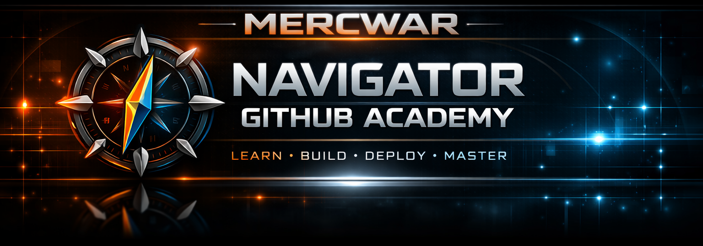

<a target="_self" title="CLICK HERE to ENTER the GATEWAY FREE!" href="https://mercwar.github.io/Constellation/index.html">

</a>


---

## 💡 What This <a target="_self" title="GOTO THE TUTORIAL" href="./readme_toc.md">Tutorial</a> App Is

The **Navigator GitHub Academy** is a **fully navigable Markdown learning app** built inside a GitHub repository.  
It transforms a standard README into an interactive course — a guided academy that teaches GitHub fundamentals, open‑source collaboration, version control, automation, and publishing.

Each page acts like a **lesson module**, with **Home**, **Back**, **Forward**, and **TOC** links for seamless navigation.  
No scripts, no dependencies — just pure Markdown that behaves like an app.

---
The <a target="_self" title="GOTO THE TUTORIAL" href="./readme_toc.html">Tutorial</a> is located <a target="_self" title="GOTO THE TUTORIAL" href="./readme_toc.html">HERE</a>
---

# 🧭 **NOW THE MAIN README.md — MercWar Publication Edition**
  <a target="_self" title="CLICK HERE to ENTER the GATEWAY FREE!" href="https://mercwar01.byethost3.com">

</a>


---


# 🛡️ MERCWAR PUBLICATION  
# 🧭 MercWar Navigator GitHub Academy  
### Learn • Build • Deploy • Master


## ⚙️ How It Works

- The **main README** introduces the academy and links to all modules.  
- The **TOC file** (`readme_toc.md`) serves as the central index.  
- The **tutorial pages** (20 total) live in the `/app/` directory.  
- Each page includes:
  - MercWar publication header  
  - Navigation controls  
  - Legal footer  
  - Topic‑specific content  

Together, these files form a **self‑contained learning system** that runs entirely within GitHub.

---

## 📚 <a target="_self" title="GOTO THE TUTORIAL" href=./"readme_toc.md">Academy</a> Structure Overview 


```
MercWar-Navigator-GitHub-Academy/
│
├── README.md
├── readme_toc.md
└── app/
    ├── 01-what-github-is.md
    ├── 02-open-source-explained.md
    ├── 03-open-source-licenses.md
    ├── 04-create-your-first-repo.md
    ├── 05-understanding-commits.md
    ├── 06-branches-and-merging.md
    ├── 07-pull-requests.md
    ├── 08-forking-vs-cloning.md
    ├── 09-why-code-is-compiled.md
    ├── 10-github-desktop.md
    ├── 11-browsing-repos.md
    ├── 12-searching-github.md
    ├── 13-trending-projects.md
    ├── 14-repo-structure.md
    ├── 15-codespaces.md
    ├── 16-github-actions.md
    ├── 17-issues-discussions-wikis.md
    ├── 18-security-and-secrets.md
    ├── 19-maintaining-repos.md
    └── 20-github-pages.md
```

---

## 🚀 How to Navigate

1. Start at **Page 1 — What GitHub Is**.  
2. Use **Back** and **Forward** links to move through lessons.  
3. Jump anywhere using the **TOC** link.  
4. Return here anytime with the **Home** link.  
5. Explore GitHub while reading — hands‑on learning is the fastest path.

---

## 🧩 Why It Exists

MercWar built this <a target="_self" title="GOTO THE TUTORIAL" href="./readme_toc.md">academy</a> to make GitHub learning **immersive and self‑contained**.  
Instead of static documentation, you get a **living README app** — a guided experience that feels interactive, yet runs entirely in Markdown.

It’s designed for:
- Developers learning GitHub fundamentals  
- Teams onboarding new contributors  
- Educators teaching open‑source workflows  
- Anyone who wants a structured, visual learning path

---

Click here to begin the <a target="_self" title="GOTO THE TUTORIAL" href="./readme_toc.md">Tutorial</a>


## 🛡️ MercWar Publication Notice

This academy is an official MercWar educational release.  
All content is original, structured, and designed for public learning.

---


  <a target="_self" title="CLICK HERE to ENTER the GATEWAY FREE!" href="https://mercwar01.byethost3.com">

</a>

```
© 2026 MERCWAR INTELLIGENCE NETWORK  
All rights reserved.  
Unauthorized reproduction or redistribution is prohibited.

```
