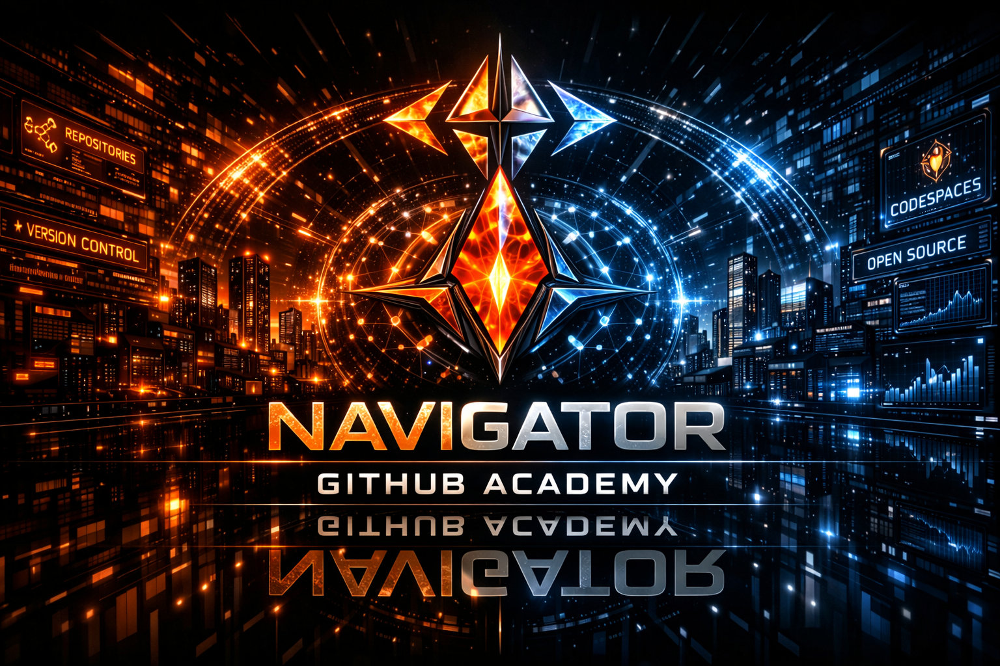

✨Avis Portal
- Gateway 🏠 [Home](../README.md)
- Gateway Portal 📚 [Full TOC](../readme_toc.md)
- Previous Up-link: ➡️ [trending projects](./13-trending-projects.md)
- Next Up-link: ➡️ [codespaces](./15-codespaces.md)
  

  

# 🛡️ MERCWAR PUBLICATION  
### Navigator GitHub Academy — Page 15 of 20

# Repo Structure

Git and GitHub are foundational components of modern development. To understand them, it is helpful to distinguish between the **tool** (Git) and the **platform** (GitHub).

### 🛠️ The Conceptual Distinction

* **Git (The Tool):** A **Distributed Version Control System (DVCS)**. It lives on your local machine and tracks the "deltas" (changes) to your files over time. It allows you to save snapshots of your work, revert to previous versions, and work on different features simultaneously without corrupting your main code.
* **GitHub (The Platform):** A **Cloud-Based Hosting Service**. It provides a central location (a remote server) to store your Git repositories. It adds collaborative layers like Issue tracking, Pull Requests (PRs), code review interfaces, and CI/CD automation pipelines.

---

### 🧩 The Three-Stage Git Architecture

Understanding how Git manages data internally is critical for avoiding common errors. Git views your file lifecycle in three distinct stages:

1. **Working Directory:** The actual files you are editing on your computer right now.
2. **Staging Area (Index):** A "buffer" where you prepare specific changes for the next snapshot. This allows you to group related changes together.
3. **Repository (.git folder):** The permanent database where your snapshots (commits) are stored.

---

### 🚀 Key Mechanics for Architects

As a systems architect, you should view these concepts not just as commands, but as **state management protocols**:

* **Commits as Cryptographic Snapshots:** Every commit is an immutable node in a directed acyclic graph (DAG), identified by a unique SHA-1 hash.
* **Branches as Pointer Logic:** A branch is merely a lightweight, movable pointer to a specific commit. This makes branching "cheap" and enables massive parallel development.
* **Merging as Integration:** Merging is the process of reconciling two different DAG paths. When you submit a **Pull Request**, you are formally proposing that the history of your feature branch should be grafted onto the target branch's history.

---

### 📋 Recommended Workflow for Standardization

To maintain the "MERCWAR" standard of code quality, standardize your team's workflow:

1. **Clone:** Pull the remote state to your local environment.
2. **Branch:** Always work in an isolated feature branch.
3. **Stage & Commit:** Group logical changes into atomic commits.
4. **Push:** Sync your local history to the remote.
5. **Pull Request:** Open the formal integration gate for peer review and CI/CD validation.

[How to use Git and GitHub for beginners](https://www.youtube.com/watch?v=RGOj5yH7evk)

This video provides a clear walkthrough of the core Git commands—add, commit, push, and pull—that are essential for managing your repository lifecycle effectively.

---
✨Avis Portal
- Gateway 🏠 [Home](../README.md)
- Gateway Portal 📚 [Full TOC](../readme_toc.md)
- Previous Up-link: ➡️ [trending projects](./13-trending-projects.md)
- Next Up-link: ➡️ [codespaces](./15-codespaces.md)
  

---

© 2026 MERCWAR INTELLIGENCE NETWORK  
All rights reserved.
